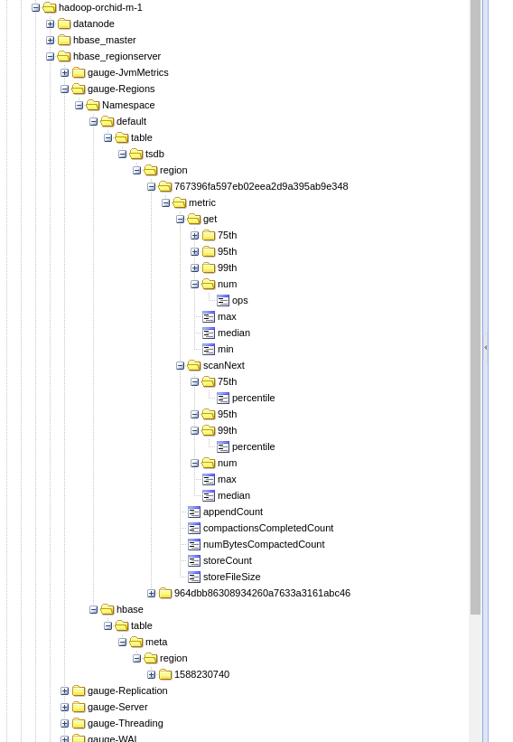

# collectd-hadoop

A [collectd](http://collectd.org) plugin for [Hadoop](https://hadoop.apache.org/)

It collects data from the http `/jmx` endpoints for:

* [x] HDFS NameNodes
* [x] HDFS DataNodes
* [x] HDFS JournalNodes

* [x] Hbase Masters
* [x] Hbase Regionservers

These are currently all we use, so if you would like to monitor other pieces, pull requests
are greatly appreciated.

## Install

1. Place `hadoop.py` in /opt/collectd/lib/collectd/plugins/python (assuming you have collectd installed to /opt/collectd).
2. Configure the plugin (see below).
3. Restart collectd.

Configuration
-------------
 * See `hadoop.conf` for more detailed examples
 * Some special fields are converted from string 'true' or 'active' to boolean
 * Remember that boolean derives from integer in python.

* ReplaceUnderscore parameter
 If you use `write_graphite` then you may be interested in using `PreserveSeparator false` and this plugin with setting `ReplaceUnderscore true`.
 This way you will get nested structure for some keys with underscores - it is especially useful for HBase Regionserver.
 For example:
 `gauge-Regions_Namespace_default_table_tsdb_region_674eb5d0ee8c78ca0c81fd35fa3183b3_metric_scanNext_min`
 will be changed to
 `gauge-Regions.Namespace.default.table.tsdb.region.674eb5d0ee8c78ca0c81fd35fa3183b3.metric.scanNext.min`
 and with `write_graphite` using `PreserveSeparator false` it will be nested structure, instead of one long plain entry.
 Notice that if enabled then ALL metrics which contain underscores will be converted, so it will require to change graphs/searches, though.
 Example:
  


Requirements
------------
 * collectd 4.9+
 * Hadoop 2.7.1
 * HBASE 1.1.2

## Testing

We have stubbed out a few things to aid in development of this plugin. Functional tests are run
inside `Docker` with the help of `docker-compose`

```bash
$ docker-compose build tests
$ docker-compose run tests
...
collected 3 items

tests/test_collectdharness.py::test_defaults PASSED
tests/test_collectdharness.py::test_happy_path_children_count PASSED
tests/test_config.py::test_defaults PASSED
...
```

`docker-compose` respects exit codes, so if the tests fail, the status code will be non-zero. Super helpful for
build environments.
